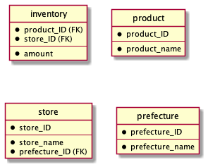
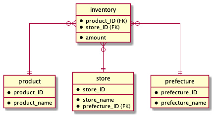

## RDBMS

RDBMS stands for Relational Database Management System, and a database system that stores and manages data separately for each table.  
For example, MySQL, OracleDB, PostgreSQL etc..  
This time, we will use MySQL, the most popular RDBMS.

## MySQL Configuration

The first step is to set up a database box in MySQL.  
Each database box is named.  
The database then stores a table which is stored data in each of these.

## Table (entity)

In a DB, a table is also called an entity.

| Product_ID | Product_name | amount |
| :---: | :---: | :---: |
| 001 | dresser | 10 |
| 002 | chair | 5 |
| 003 | table | 20 |
| 004 | Lighting | 100 |

For a table like the one above,  
the rows you see horizontally are called **row (record)**,  
the columns you see vertically are called **attribute (column)**,  
and each cell is called a **value (field)**.

## Table features

Do not keep duplicate copies of the same record in a database table.  
For example, a unique product ID is defined as the **primary key** so that the product can be identified even if the product names overlap.  
Also, when each store handles products, it is difficult to create a database for each store, so store ID and product ID are defined as the **composite primary key**.

## primary key

A key that uniquely identifies a record.  
The characteristic of a primary key is that it is always non-overlapping and basically unchanging.

## composite primary key

A method of defining a primary key set in a database table as a combination of multiple items (columns).  
With this, Records can be uniquely identified by multiple attributes.

### For example (insufficient as a table..)

| productID | storeID | storename | productname | amount |
| :---: | :---: | :---: | :---: | :---: |
| 001 | 01 | A | dresser | 1 |
| 002 | 01 | A | chair | 2 |
| 001 | 02 | B | dresser | 10|
| 002 | 02 | B | chair | 5 |

## Table Splitting

|There are two problems with the above table.

- This is troublesome when changing the store name.

	In the case of the table above, we have to modify two records.

- Maybe there is a store C as well.

	We need to add it along with the product ID and store ID.

Therefore, it is better to write the store table and the inventory table separately.

## Foreign Key

Key to use to join with other tables.  
In the case of the table above, by using the store ID which is the composite primary key as a foreign key,  
the store information and inventory information can be retrieved as a single record by checking the store ID in the inventory table against the store ID in the store table. (JOIN, described below.)

### For example (splitted tables)

- inventory table

| productID | storeID | productname | amount |
| :---: | :---: | :---: | :---: |
| 001 | 01 | dresser | 1 |
| 002 | 01 | chair | 2 |
| 001 | 02 | dresser | 10|
| 002 | 02 | chair | 5 |

- store table

| storeID | storename |
| :---: | :---: |
| 01 | A |
| 02 | B |
| 03 | C |

## Database normalization

[Database normalization](https://en.wikipedia.org/wiki/Database_normalization) is the process of structuring a database, usually a relational database, in accordance with a series of so-called normal forms in order to reduce data redundancy and improve data integrity.  
It is used universally in table definitions.  

- [Unnormalized form](https://en.wikipedia.org/wiki/Unnormalized_form)

	A condition in which the row and column data are not one-to-one.  
	Certain attributes are spread across multiple lines, so we need to separate these into individual lines (first normalization).

	| store | prefecture | product | amount |
	| :---: | :---: | :---: | :---: |
	| A | Tokyo | dresser<br>chair | 10<br>5 |

- first normalization

	Assume that the row and column data are one-to-one.  
	Also, select the primary key that identifies the record to the first place.

	| storeID | store | prefectureID | prefecture | productID | product | amaount |
	| :---: | :---: | :---: | :---: | :---: | :---: | :---: |
	| 01 | A | 001 | Tokyo | 001 | dresser | 10 |
	| 01 | A | 001 | Tokyo | 002 | chair | 5 |

	A table that has undergone the first normalization, as in the table above, is called a [1NF](https://en.wikipedia.org/wiki/First_normal_form) (First normal form).

- second normalization

	Separate attributes that are subordinate to a part of the primary key into a separate table.  
	This process removes partial function dependency.

	- partial function dependency

		Once the store ID is determined, the store name is determined, and once the product ID is determined, the product name is determined.  
		The attribute that is specified when one of the attributes is determined is called partial function dependency.

	- full functional dependency

		An attribute (in this case, quantity) that is uniquely identified by a primary key (in this case, the two attributes of store ID and product ID).

	| storeID | productID | amount |
	| :---: | :---: | :---: |
	| 01 | 001 | 10 |
	| 01 | 002 | 5 |

	| productID | product |
	| :---: | :---: |
	| 001 | dresser |
	| 002 | chair |

	| storeID | store | prefectureID | prefecture |
	| :---: | :---: | :---: | :---: |
	| 01 | A | 001 | Tokyo |
	| 01 | A | 001 | Tokyo |

	A table that has undergone the second normalization, as in the table above, is called a [2NF](https://en.wikipedia.org/wiki/Second_normal_form) (Second normal form).

- third normalization

	Separate attributes that are subordinate to attributes other than the primary key into a separate table.

	- transitive functional dependency

		An attribute that is functional dependency other than the primary key.

	| storeID | productID | amount |
	| :---: | :---: | :---: |
	| 01 | 001 | 10 |
	| 01 | 002 | 5 |

	| productID | product |
	| :---: | :---: |
	| 001 | dresser |
	| 002 | chair |

	| storeID | store | prefectureID |
	| :---: | :---: | :---: |
	| 01 | A | 001 |
	| 01 | A | 001 |

	| prefectureID | prefecture |
	| :---: | :---: |
	| 001 | Tokyo |
	| 001 | Tokyo |

	A table that has undergone the third normalization, as in the table above, is called a [3NF](https://en.wikipedia.org/wiki/Third_normal_form) (Third normal form).

After this, normalization will still exist, but the cost will be worse and performance will be degraded because the table will be too detailed.  
Therefore, it is generally only done up to the third normalization.

## ER Diagram

ER Diagram stands for Entity-Relationship Diagram.  
It is the notation for visualizing relationships among tables (entities).  

  

It looks like the figure above.  
The upper part separated by a horizontal line represents the primary key, and the lower part is the non-primary key.

## Information Engineering

Typical notation for representing table relationships in ER diagram.  
The number of records between tables is called **cardinality**.

| mark | means |
| :---: | :---: |
| ○ | 0 |
| \| \(or \|\|\) | 1 |
| bird foot | many |

If it write cardinality on the above ER diagram, it is the following diagram.  

  

- Relationship between **inventory** and **product**

	The product table in terms of the inventory table has only one record, and the inventory table in terms of the product table has zero or more records.

- Relationship between **inventory** and **store**

	The store table in terms of the inventory table has only one record, and the inventory table in terms of the store table has zero or more records.

- elationship between **store** and **prefecture**

	The prefecture table in terms of the store table has only one record, and the store table in terms of the prefecture table has zero or more records.

### PlantUML

In this case, we used the open source tool PlantUML for the ER diagram.  
<https://plantuml.com/en/>  

- Installation (for Mac with brew)

	1. command

		```sh
		brew install plantuml
		```

	2. Install the PlantUML plugin in VSCode

		In the Extensions tab on the left sleeve of VSCode, search and install for plantuml.

- Usage (for ER Diagram)

	1. create file

		Use the ".pu" extension and follow the instructions in [this document](https://plantuml.com/en/ie-diagram).

	2. preview image

		You can display the preview image of a UML diagram by pressing ```option+d```.

	3. save the preview image

		1. Open the VSCode command palette with ```command+shift+p```

		2. In the input screen, type ```plantuml``` to get some suggestions, and select **PlantUML: Export current diagram**

		3. Then you will see a list of file formats, select one

		4. After selecting the file format, you will be notified of where to save the file and the image of the UML diagram has been saved
